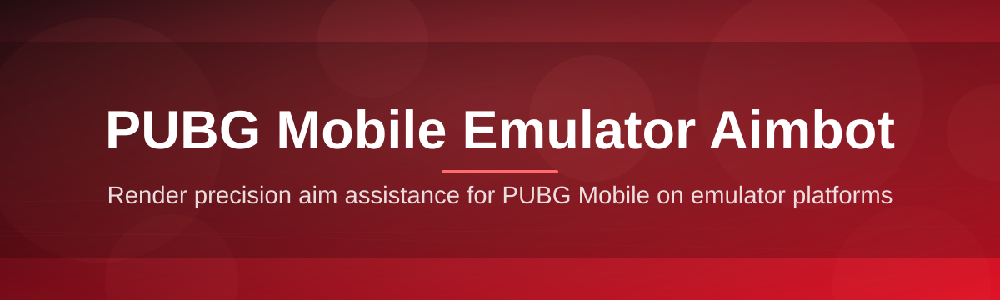

# pubg-mobile-emulator-controller

Render precision aim assistance for PUBG Mobile on emulator platforms

  

## Overview

Render precision aim assistance for PUBG Mobile on emulator platforms

## License

[MIT License](LICENSE)
